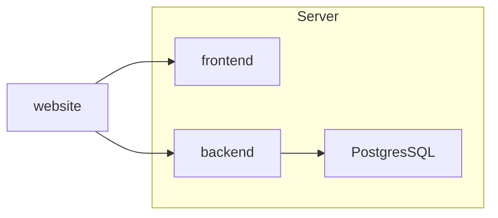
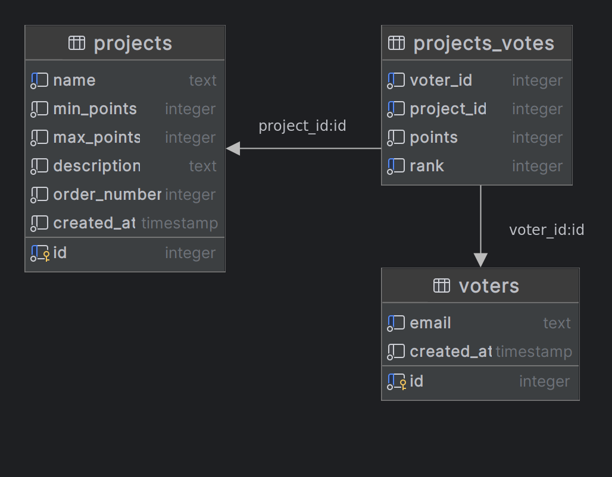

# equal-shares

[](https://github.com/equal-shares/equal-shares/actions/workflows/lint.yml)

## About

This project is a voting application and algorithm based [Equal Shares](https://equalshares.net/) \
For Ariel University

## Table of content

* [About](#about)
* [Technologies](#technologies)
  * [Versions](#versions)
* [Files Structure](#files-structure)
  * [Production Files Structure](#production-files-structure)
* [Environment Variables](#environment-variables)
  * [Backend](#backend)
  * [Frontend](#frontend)
  * [Database](#database)
* [Diagrams](#diagrams)
  * [Communication Diagram](#communication-diagram)
  * [Database ERD](#database-erd)
* [Requirements](#requirements)
  * [For Using Locally](#for-using-locally)
  * [For Development](#for-development)
* [Installation - Local](#installation---local)
  * [For Development](#for-development)
* [Usage](#usage)
  * [Management](#management)
* [Development](#Development)
* [Production](#production)
  * [Production Scripts](#production-scripts)
  * [Production Monitoring and Logs](#production-monitoring-and-logs)
  * [Production Requirements](#production-requirements)
  * [Production Installation](#production-installation)
* [Links](#links)
* [Authors](#authors)
* [License](#license)

## Technologies

* python - As programming language for the backend
* conda - For managing python environment
* poetry - For managing python dependencies
* FastAPI - As framework for the backend
* uvicorn - For running the backend usinn ASGI
* PostgresSQL - As database
* docker - For development in production of the backend
* docker compose - For local development
* React - As framework for the frontend
* TypeScript - As programming language for the frontend
* Vite - As build tool for the frontend
* Tailwind CSS - For styling the frontend
* MUI - As UI library for the frontend
* GitHub Actions - For running the linters

### Versions

* python 3.12
* node 21
* PostgresSQL 16

## Files Structure

* .github
  * workflows
    * lint.yml - Running the linters
* backend - The backend API
  * src
    * routers
      * admin - routes for managmenet
      * form - routes for the frontend
      * report - routes for the reports of the votes and the algorithm
    * `__main__` - the entry of the backend application using CLI
    * app.py - the application of the backend that used by uvicorn
    * cli - CLI commands for the backend
    * config.py - contains the configuration of the backend. uses environment variables
    * database.py - database connection
    * exceptions.py - custom exceptions
    * logger.py - logging configuration
    * models.py - models and queries for comunicating with the database
    * schemas.py - schemas of the API
    * security.py - security functions
  * Dockerfile.dev - for building the backend local development
  * Dockerfile.prod - for building the backend in production
  * equal-shares-api-private-key.pem - private RSA key for the API for local development, ignored in git
  * equal-shares-api-public-key.pem - public RSA key for the API for local development, ignored in git
  * Makefile - commands for development
  * poetry.lock - lock file of the dependencies, dont change manually
  * pyproject.toml - configuration and poetry dependencies
* docs - documentation and spesification files
* frontend - The frontend application
  * public - static files
  * src
    * assets - images and icons
    * components
    * api.ts - for using the backend API
    * App.tsx - the main component
    * config.ts - configuration of the frontend at build time
    * main.tsx - the entry of the frontend application
    * schema.ts - schemas of the API
  * Dockerfile.dev - for building the frontend local development
  * Dockerfile.prod - for building the frontend in production
  * package-lock.json - lock file of the dependencies, dont change manually
  * package.json - dependencies and commands for development
* prod - files for production server
  * db
    * pg_hba-original.conf - original pg_hba.conf of the PostgresSQL
    * pg_hba.conf - configuration of the PostgresSQL
  * backend.env - environment variables for the backend service, will copy to /app/backend.env
  * db.env - environment variables for the database service, will copy to /app/db.env
  * frontend.env - environment variables for build the frontend, will copy to /app/frontend.env
* res - resources
* scripts - scripts for production
  * build.sh - building the services
  * check-database.sh - checking that the backend can connect to the database
  * pull.sh - pulling the latest version of the code, build the services and restart the services
  * rest-env-files.sh - copying the environment files to the /app directory
  * restart.sh - restarting the services
* dev.docker-compose.yml - for local development
* environment.yml - conda environment
* LICENSE - MIT license
* Makefile - commands for development
* prod.docker-compose.yml - for production
* README.md - this file

### Production Files Structure

* /app - the root directory of the project
  * /backend.env - environment variables for the backend service (container)
  * /db.env - environment variables for the database service (container)
  * /equal-shares - the project directory
  * /frontend.env - environment variables for build the frontend image
  * /keys
    * equal-shares-api-private-key.pem - private RSA key for the API
    * equal-shares-api-public-key.pem - public RSA key for the API

## Environment Variables

### Backend

Table of the required environment variables for the backend:

| Variable            | Description                       |
|---------------------|-----------------------------------|
| PG_DATABASE         | PostgresSQL database name         |
| PG_USER             | PostgresSQL user                  |
| PG_PASSWORD         | PostgresSQL password              |
| PG_HOST             | PostgresSQL host                  |
| ADMIN_KEY           | uuid for admin key                |
| API_RSA_PUBLIC_KEY  | path to public RSA key for API    |
| API_RSA_PRIVATE_KEY | path to private RSA key for API   |

Table of the optional environment variables for the backend:

| Variable | Description      | Default |
|----------|------------------|---------|
| PG_PORT  | PostgresSQL port | 5432    |

### Frontend

Table of the required environment variables for the frontend, they used at build time:

| Variable      | Description      |
|---------------|------------------|
| VITE_API_HOST | API backend host |

### Database

Table of the required environment variables for the database:

| Variable          | Description              |
| ----------------- | ------------------------ |
| POSTGRES_PASSWORD | Password for PostgresSQL |

Table of the optional environment variables for the database:

| Variable      | Description           | Default  |
| ------------- | --------------------- | -------- |
| POSTGRES_USER | defualt user          | postgres |
| POSTGRES_DB   | defualt database name | postgres |

## Diagrams

### Communication Diagram



## Database ERD



## Requirements

### For Using Locally

* docker

### For Development

* conda
* node 21.5.0

## Installation - Local

Create or Copy the RSA keys of the API to the backend directory.
* ./backend/equal-shares-api-private-key.pem
* ./backend/equal-shares-api-public-key.pem

Run the following commands to install:

```bash
git clone git@github.com:omer-priel/equal-shares.git
cd equal-shares

docker compose build
```

### For Development

Run the following commands to install for development:

```bash
conda env create -f environment.yml
conda activate equal-shares

cd backend
poetry config virtualenvs.create false
poetry install

cd ../frontend
npm ci
```

## Usage

For running the frontend, backend and the database run the following command:

```bash
make serve
```

Or

```bash
docker compose -f dev.docker-compose.yaml up --build
```

The API will run on http://localhost:8000/

In the API Dashbord (Swagger UI) you can see, manage and test the System. \
admin_key is key for authentication as admin and you can have it from docker-compose.yml under the environments of backend.

And the frontend will run on http://localhost:5173/

The frontend is a simple form for voting. \
For authentication the URL needs the paramters email and token.

For example: http://localhost:5173/?email=some.mail%40example.com&token=jJfGlbWO7%2BxiPCaMofLnX2zYFIGZOuBQ1Vg65zAyUd0EVAfk36y%2FIzH67UAUGsrjlvMKMsF9%2FIAlMC66Ner2g9vyP%2F%2FazBMirFpN9spDyFeHAiEk3tmz%2FlCXnQfz%2BDmayKZsxO5n%2BLf1bs4eF8TR6u8wwQumV%2BnErXvF1%2BCy4W0%3D

You can create a token using /admin/create-token in the API Dashbord.

### Management

Creating the database tables: \
In the API Dashbord run /admin/create-tables

Change settings: \
In the API Dashbord run /admin/set-settings
* max_total_points - the maximum total points a voter can give to all the projects in total
* points_step - a number that points in votes can be divided by.
  For example if `points_step` is 100, vouter cannot give 150 points to a project but can give 100 or 200 points.

Delete all the projects, votes and vouters: \
In the API Dashbord run /admin/delete-projects-and-votes

Delete votes and voters:
In the API Dashbord run /admin/delete-votes

Add new projects from XLSX file: \
In the API Dashbord run /admin/add-projects
* xlsx_file - the XLSX file with the projects. The columns should be:
  column 1: name of the project
  column 2: min points of the project
  column 3: max points of the project
  column 4: this column is not in use
  column 5: description of the project,

Get the Projects and Settings as JSON format: \
In the API Dashbord run /admin/projects

## Development

For clean, safe and maintainable deployment exits number of Linters and Formatters.
* Formaters - are tools that automatically format and fix the code.
  * Backend: isort, black
  * Frontend: Prettier, ESLint
* Linters - are tools for check the code.
 * Backend: flake8, black, mypy
 * Frontend: ESLint

Before running the formatter and linters, make sure conda environment is activated and node version is 21.5.0 \
For running the formatters and linters run the following commands:

```bash
make fix-lint
```

For running only the formatters run the following commands:

```bash
make fix
```

For running only the linters run the following commands:

```bash
make lint
```

For running the services run the following command:

```bash
make serve
```

## Production

The project will be saved in: /app
For managing the server you have scripts under /app/equal-shares/scripts

### Production Scripts

This following scripts will:
* pull the latest version of the code from GitHub
* update backend and frontend images if needed
* restart the services

```bash
bash /app/equal-shares/scripts/pull.sh
```

For restarting the services run the following command:

```bash
bash ./scripts/restart.sh
```

For reset the environment variables files by copying the files to the /app directory run the following command:

```bash
bash /app/equal-shares/scripts/rest-env-files.sh
```

For building the services run the following command:

```bash
bash /app/equal-shares/scripts/build.sh
```

For checking manually that backend can connect to the database run the following command:

```bash
bash /app/equal-shares/scripts/check-database.sh
```

### Production Monitoring and Logs

For view all the services run the following command:

```bash
docker ps
```

For viewing the logs (100 lines) of the backend service run the following command:

```bash
docker logs equal-shares-backend-1 --tail 100
```

For viewing the logs (100 lines) of the frontend service run the following command:

```bash
docker logs equal-shares-frontend-1 --tail 100
```

For viewing the logs (100 lines) of the database service run the following command:

```bash
docker logs equal-shares-db-1 --tail 100
```

### Production Requirements

* Linux Server
* SSH
* RSA keys for the API (equal-shares-api-private-key.pem and equal-shares-api-public-key.pem)

### Production Installation

In the next steps we will show how to install the project on new production server.

1. Use SSH for connecting to the server
2. Run the following commands for update server:

```bash
sudo apt update
sudo apt upgrade -y
```

3. For install docker and docker compose run the following commands:

```bash
sudo apt-get install -y ca-certificates curl
sudo install -m 0755 -d /etc/apt/keyrings
sudo curl -fsSL https://download.docker.com/linux/ubuntu/gpg -o /etc/apt/keyrings/docker.asc
sudo chmod a+r /etc/apt/keyrings/docker.asc

# Add the repository to Apt sources:
echo \
  "deb [arch=$(dpkg --print-architecture) signed-by=/etc/apt/keyrings/docker.asc] https://download.docker.com/linux/ubuntu \
  $(. /etc/os-release && echo "$VERSION_CODENAME") stable" | \
  sudo tee /etc/apt/sources.list.d/docker.list > /dev/null
sudo apt-get update

# Install Docker
sudo apt-get install -y docker-ce docker-ce-cli containerd.io docker-buildx-plugin docker-compose-plugin
```

4. For check the installation of docker run the following command:

```bash
sudo docker run hello-world
```

5. For installing the project run the following commands:

```bash
mkdir /app
cd /app
git clone https://github.com/equal-shares/equal-shares.git
```

6. For configuring the environment variables run the following commands:

```bash
ash /app/equal-shares/scripts/rest-env-files.sh
```

For creating Admin Key run the following command:

```bash
python3 -c "import uuid;print(uuid.uuid4())"
```

Save the output of the command, this is the Admin Key for managing the API \
Copy the output and paste it to the /app/backend.env as value of ADMIN_KEY using nano:
  
```bash
nano /app/backend.env
```

Use nano for editing VITE_API_HOST in /app/frontend.env \
Replace the value of VITE_API_HOST with `http://<server-ip>:8000` the `server-ip` is the IP of the server

```bash
nano /app/frontend.env
```

7. Run the folowing commands for create directory for the Keys:
  
```bash
mkdir -p /app/keys
```

8. For adding the api RSA keys disconnect the SSH \
    Copy the RSA keys of the API to production server using the following commands:

Note: replace <server-ip> with the IP of the server and you should have the keys in your current directory

```bash
scp equal-shares-api-private-key.pem root@<server-ip>:/app/keys/equal-shares-api-private-key.pem
scp equal-shares-api-public-key.pem root@<server-ip>:/app/keys/equal-shares-api-public-key.pem
```

9. Connect to the server using SSH

10. Update the permissions of the directories:

```bash
chmod 744 /app/**
```

11. For open the ports run the following commands:

```bash
sudo ufw allow 80
sudo ufw allow 8000
```

11. For build and start the services run the following commands:

```bash
bash /app/equal-shares/scripts/build.sh
```

12. For start the services run the following commands:

```bash
bash /app/equal-shares/scripts/pull.sh
```

For checking the services open in Browser (like Google Chrome) the URL: http://<server-ip>:8000/ \
And open the URL: http://<server-ip>/

13. For creating the database tables open the URL: http://<server-ip>:8000/ \
    And run the route `/admin/create-tables`

## Links

* [ca website](https://faircourse.csariel.xyz/)
* [ca-frontend](https://github.com/ariel-research/cap-frontend)
  Original frontend - React
* [ca-backend](https://github.com/ariel-research/cap-backend)
  Original backend - Django
* [equalshares.net](https://equalshares.net/)
* [Final-Project](https://github.com/ElhaiMansbach/Final-Project)
  For the algorithm of equal shares - Flask and React

# Authors

* Bar Nahmias
* Didi Avidad
* Omer Priel

## License

MIT
